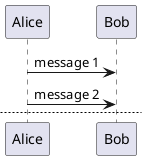

# pandoc-panflute-plantuml-filter

Pandoc-panflute-plantuml filter for PlantUML code blocks

## usage 
~~~
# title

~~~


## additional parameters
~~~
# level-1 title
```{
    .plantuml
    header="1,A level-1 title for the 1st page"
    header_001="2,A level-2 title for the 2nd page"
    header_002="2,A level-2 title for the last page"
}
@startuml

Alice -> Bob : message 1
Alice -> Bob : message 2

newpage

Alice -> Bob : message 3
Alice -> Bob : message 4

newpage A title for the\nlast page

Alice -> Bob : message 5
Alice -> Bob : message 6
@enduml

```
~~~
